<h3><code>akshit@github ~ $ ./contributions.sh</code></h3>

  

<h3><code>akshit@github ~ $ whoami</code></h3>

<table>
<tr>
<td valign="top"></td>
<td valign="top"></td>
</tr>
</table>

 

<code>AI/ML • Robotics • Digital Twins • Lunar Infrastructure</code>

---

## About

I build systems at the intersection of **AI/ML, robotics, simulation, and lunar infrastructure**.

- 🔭 Co-Managing Partner at **Lunabers**
- 🤖 AI/ML, robotics, computer vision and digital twins
- 🧠 Python, PyTorch, TensorFlow, LLMs and MLOps
- 🌙 Researching software and infrastructure for future lunar systems

## The terminal profile

This profile is intentionally self-hosted.

- No JavaScript in the README
- No GitHub token required for the contribution calendar
- Animated SVGs are committed directly to the repository
- GitHub Actions refreshes the contribution graph every day

The portrait and profile card are static artwork. The contribution graph is regenerated from GitHub's public contribution-calendar HTML.

## Current focus

**Lunabers** — lunar infrastructure research across robotics, mobility, digital twins, ISRU, power/energy architecture, communications and terrain simulation.

---

<code>akshit@github:~$ echo "build • research • ship"</code>

